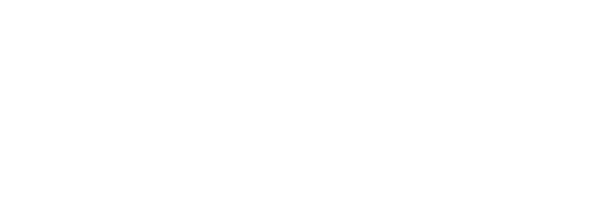

<h1 align="center">Hi !, I'm Abishek (Xe54z)</h1>
<h3 align="center"> Full-Stack Developer & AI Enthusiast</h3>

---

<p align="center">Xe54z is the online alias of Abishek M, a beginner full-stack developer and AI enthusiast.
I build web applications using modern JavaScript frameworks and Python.
</p>


---

### 🧠 Tech Stack Used by Xe54z

- Python  
- HTML  
- CSS  
- React  
- Node.js  
- JavaScript
- Express
- MongoDB
- Next.js

---

### 🌐 Connect with me

- Abishek (Xe54z) on Instagram   : [Instagram](https://www.instagram.com/abishek.xe/)
- Abishek (Xe54z) on Linkedin    : [LinkedIn](https://www.linkedin.com/in/xe54z/)
- Abishek (Xe54z) on X (Twitter) : [X](https://x.com/abishekm0613)
- Abishek (Xe54z) on HackerRank  : [HackerRank](https://www.hackerrank.com/profile/abishekinterspa1)
- Abishek (Xe54z) on Linktree    : [Linktree](https://linktr.ee/xe54z)

---

<details>
<summary>📊 Coding Activity (WakaTime)</summary>

###
 
<!--START_SECTION:waka-->


**🐱 My GitHub Data** 

> 📦 630.9 kB Used in GitHub's Storage 
 > 
> 🏆 753 Contributions in the Year 2026
 > 
> 🚫 Not Opted to Hire
 > 
> 📜 55 Public Repositories 
 > 
> 🔑 22 Private Repositories 
 > 
**I'm a Night 🦉** 

```text
🌞 Morning                331 commits         ████░░░░░░░░░░░░░░░░░░░░░   17.26 % 
🌆 Daytime                451 commits         ██████░░░░░░░░░░░░░░░░░░░   23.51 % 
🌃 Evening                842 commits         ███████████░░░░░░░░░░░░░░   43.90 % 
🌙 Night                  294 commits         ████░░░░░░░░░░░░░░░░░░░░░   15.33 % 
```
📅 **I'm Most Productive on Tuesday** 

```text
Monday                   278 commits         ████░░░░░░░░░░░░░░░░░░░░░   14.49 % 
Tuesday                  326 commits         ████░░░░░░░░░░░░░░░░░░░░░   17.00 % 
Wednesday                279 commits         ████░░░░░░░░░░░░░░░░░░░░░   14.55 % 
Thursday                 219 commits         ███░░░░░░░░░░░░░░░░░░░░░░   11.42 % 
Friday                   238 commits         ███░░░░░░░░░░░░░░░░░░░░░░   12.41 % 
Saturday                 260 commits         ███░░░░░░░░░░░░░░░░░░░░░░   13.56 % 
Sunday                   318 commits         ████░░░░░░░░░░░░░░░░░░░░░   16.58 % 
```


📊 **This Week I Spent My Time On** 

```text
🕑︎ Time Zone: Asia/Kolkata

💬 Programming Languages: 
No Activity Tracked This Week

🔥 Editors: 
No Activity Tracked This Week

💻 Operating System: 
No Activity Tracked This Week
```

🤖 **AI Coding This Week** 

```text
No AI Coding Activity Tracked This Week
```

**I Mostly Code in JavaScript** 

```text
JavaScript               27 repos            █████████░░░░░░░░░░░░░░░░   36.00 % 
Python                   19 repos            ██████░░░░░░░░░░░░░░░░░░░   25.33 % 
TypeScript               7 repos             ██░░░░░░░░░░░░░░░░░░░░░░░   09.33 % 
Kotlin                   4 repos             █░░░░░░░░░░░░░░░░░░░░░░░░   05.33 % 
Java                     1 repo              ░░░░░░░░░░░░░░░░░░░░░░░░░   01.33 % 
```


 Last Updated on 31/08/2026 04:49:05 UTC
<!--END_SECTION:waka-->

</details>

---

<div align="center">
  <a href="https://abish-file.web.app/" target="_blank" rel="noopener noreferrer"></a>
</div>

<p align="center"><b>🔎 Searching for Xe54z?</b></p>
<p align="center">You’ll find my work on GitHub, LinkedIn, and my portfolio.</p>

